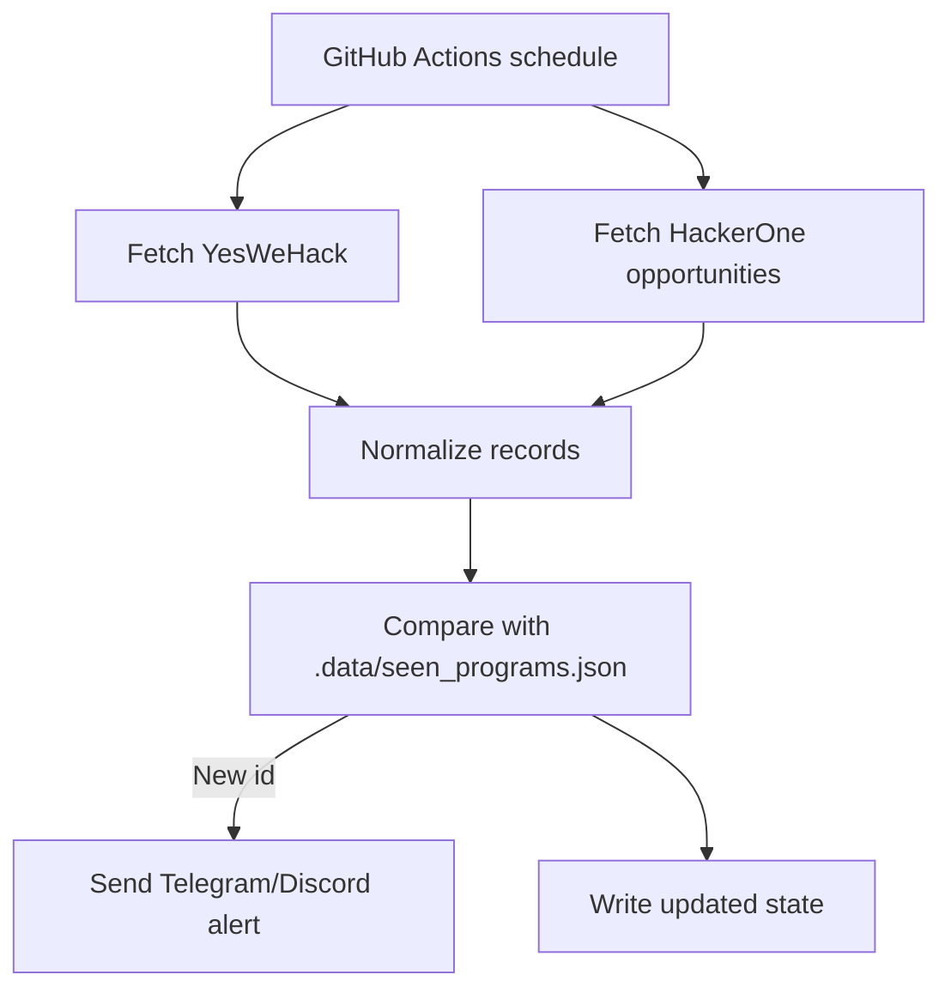

# YesWeHack New Program Watcher

[](https://github.com/killerlux/yeswehack-new-program-watcher/actions/workflows/test.yml)
[](https://github.com/killerlux/yeswehack-new-program-watcher/actions/workflows/monitor_yeswehack.yml)
[](LICENSE)
[](https://www.python.org/)

Detects **new public bug bounty programs** by first-seen identity and sends instant alerts.

This project does **not** use `Last update on` as a creation signal.

## Why this exists

On the public listing, existing programs are frequently edited. If you alert on page changes or update timestamps, you get noise.

This watcher uses a simple rule:

- if a stable program ID has never been seen before -> alert
- otherwise -> ignore

## Features

- First-seen detector for YesWeHack and HackerOne
- Source-aware IDs (legacy YesWeHack IDs + `hackerone:<id>`)
- HackerOne scope: public open opportunities with bounties only
- GitHub Actions schedule every 5 minutes
- Telegram notifications (free)
- Discord webhook support (optional)
- Safe state persistence in `.data/seen_programs.json`
- Bootstrap mode on first run (seeds state without spamming alerts)

## Quick start (under 3 minutes)

1. Fork this repository.
2. Add GitHub repository secrets:
   - `TELEGRAM_BOT_TOKEN`
   - `TELEGRAM_CHAT_ID`
3. Enable Actions in your fork.
4. Run `Monitor Public Programs` once via `workflow_dispatch`.

The first run seeds known programs. Alerts start from the next newly posted program.

When enabling a new source later (for example HackerOne after YesWeHack),
the watcher seeds that source once without alerts to avoid historical spam.

## Secrets

### Required for Telegram

- `TELEGRAM_BOT_TOKEN`
- `TELEGRAM_CHAT_ID`

### Optional for Discord

- `DISCORD_WEBHOOK_URL`

If neither channel is configured, the job logs a warning and still updates state.

## Local development

```bash
python3 -m venv .venv
.venv/bin/pip install -r requirements-dev.txt
.venv/bin/python -m pytest
.venv/bin/python -m src.monitor_yeswehack
```

## How it works



## Sample notification

```text
New HackerOne public bug bounty detected
Source: hackerone
Program: Example Bug Bounty Program
Company: Example Corp
Category: Engagements::BugBountyProgram
Rewards: EUR50 - EUR3000
Scope count: N/A
URL: https://hackerone.com/example-program
Launched at: 2026-03-11T09:00:00Z
Detected at (UTC): 2026-03-10T12:00:00Z
```

## State file format

` .data/seen_programs.json `:

```json
{
  "seen_ids": ["..."],
  "programs": {
    "<id>": {
      "name": "...",
      "url": "...",
      "source": "yeswehack|hackerone",
      "first_seen_at": "ISO8601"
    }
  }
}
```

IDs are never removed automatically.

## Troubleshooting

- Parsed zero programs: selectors likely changed; check page HTML and update `src/parser.py`.
- HackerOne fetch fails: check if GraphQL schema changed and update `src/hackerone.py`.
- No Telegram alert: verify bot token/chat id and that you sent at least one message to the bot.
- No state commit: no new IDs were found.
- Scheduled workflow stopped: GitHub may disable inactive scheduled workflows in public repos.

## Security notes

- Never commit tokens.
- Use GitHub Actions secrets only.
- Workflows pin third-party actions by commit SHA.

## Roadmap

- Optional SMTP email notifier
- Optional retry queue for transient notification failures
- Lightweight web dashboard for seen/new counts

## Contributing

See `CONTRIBUTING.md` and `SECURITY.md`.
